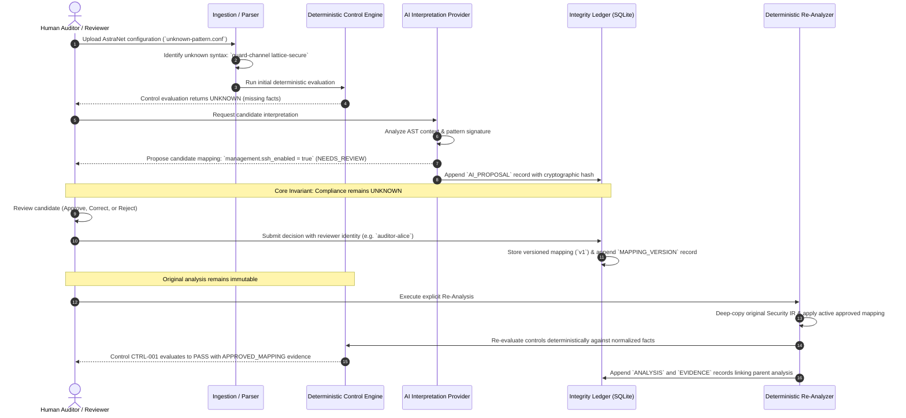

# PS 26155 Adaptive AI Learning & Semantic Mapping Workflow

**Organization:** NTRO | **Team:** CYBER MARVERICKS
**System:** AI-Driven Multi-Vendor Network Security Compliance Auditor
**Demonstration Scope:** AstraNet Synthetic Unknown-Syntax Demonstration

---

## 1. Core Architectural Principle

```
AI Proposes → Human Reviews → Versioned Knowledge Ledger → Deterministic Engine Evaluates → Cryptographic Evidence Proves
```

### Safety and Compliance Invariants
1. **AI NEVER Determines Compliance:** AI suggestions, interpretations, and candidate proposals do NOT independently alter compliance status. An AI proposal sitting in the queue produces NO change to `PASS`, `FAIL`, or `UNKNOWN` evaluations.
2. **Deterministic Engine is Sole Authority:** All control compliance results (`PASS`, `FAIL`, `UNKNOWN`, `NOT_APPLICABLE`) are determined exclusively by the deterministic YAML control engine (`DeterministicControlEngine`).
3. **No Live Network Execution:** All remediation and adaptive mapping flows remain strictly simulation-only or database-backed. The system never opens SSH/Telnet sessions, never executes commands on physical routers/switches/firewalls, and never alters running device configurations.
4. **No Base Model Retraining:** The system does NOT perform weight retraining or fine-tuning of foundation models. Adaptive learning operates through bounded, auditable, schema-validated semantic knowledge mapping persisted in a tamper-evident ledger.
5. **Human-in-the-Loop Required:** Every AI proposal requires an explicit human reviewer decision (`APPROVE`, `CORRECT_AND_APPROVE`, or `REJECT`) with recorded reviewer identity before it can become active knowledge.

---

## 2. End-to-End User Journey



---

## 3. Trust Boundary & Schema Validation

Every candidate mapping proposal must satisfy strict Pydantic validation before entering the review queue:

- `pattern_id`: Non-empty string uniquely identifying the parsed unknown syntax.
- `status`: Must be `SUGGESTED` or `NEEDS_REVIEW`.
- `confidence`: Bounded float `[0.0, 1.0]` (explicitly labeled as heuristic confidence, not guaranteed accuracy).
- `semantic_mapping`: Dictionary restricted strictly to supported normalized security properties:
  - `management.ssh_enabled` (StrictBool)
  - `management.telnet_enabled` (StrictBool)
  - `logging.enabled` (StrictBool)
  - `password_protection.enabled` (StrictBool)
  - `time_sync.ntp_enabled` (StrictBool)
- `requires_human_approval`: Hardcoded literal `True`. Any payload attempting to bypass human approval is rejected with HTTP 422.

---

## 4. Human Decision Workflows

### A. Approve Workflow
- Reviewer accepts candidate mapping as proposed.
- System records:
  - `version: 1`
  - `status: APPROVED`
  - `active: true`
  - `action: APPROVE`
  - `reviewer_id`: Human reviewer's verified identity
- Response returns `compliance_impact: UNCHANGED`. Approval alone does NOT rewrite historical analysis.

### B. Correct and Approve Workflow
- Reviewer edits normalized property values before approval (e.g., corrects `ssh_enabled` to `false`).
- System records:
  - `version: 2` (or next sequential integer)
  - `status: APPROVED`
  - `active: true`
  - `action: CORRECT_AND_APPROVE`
  - `approved_mapping`: The reviewer-corrected property dictionary
  - Previous version is marked `INACTIVE` (superseded lineage preserved).

### C. Reject Workflow
- Reviewer rejects proposal with mandatory audit rationale.
- System records:
  - `status: REJECTED`
  - `active: false`
  - `approved_mapping: null`
  - The unknown pattern remains `UNKNOWN`.

### D. Deactivation Workflow
- Active knowledge can be revoked via `POST /api/knowledge/{knowledge_id}/deactivate`.
- Status transitions to `DEACTIVATED`.
- Subsequent re-analyses require an active approved mapping; without one, the request returns HTTP 409 Conflict.

---

## 5. Immutable Child Re-Analysis Architecture

When an auditor triggers re-analysis:

1. **Parent Immutability:** The original analysis (`parent_analysis_id`) is NEVER mutated in SQLite. Its stored `SecurityIR`, control results (`UNKNOWN`), and evidence remain byte-identical.
2. **Child Analysis Creation:** A fresh child analysis is generated with:
   - `analysis_id`: New UUID
   - `parent_analysis_id`: Original analysis UUID
   - `reanalyzed: true`
   - `mapping_id` & `mapping_version`: The exact active approved version applied
3. **Pattern Recognition State:** The unmapped pattern transitions to:
   - `state: RECOGNIZED_VIA_APPROVED_MAPPING`
4. **Full Provenance Evidence:** Newly generated evidence records retain complete source provenance:
   - `evidence_source: APPROVED_MAPPING`
   - `mapping_id` and `mapping_version`
   - `original_pattern`: `guard-channel lattice-secure`
   - `original_source_file`: `unknown-pattern.conf`
   - `original_line_start`: line 5
   - `original_raw_excerpt`: `guard-channel lattice-secure`
5. **No Recursive Re-analysis:** Calling re-analysis on an already re-analyzed child record is explicitly blocked (HTTP 400).
6. **Independent Sequential Runs:** Multiple re-analyses against the same parent create independent child records reflecting the active mapping version at that point in time.

---

## 6. Cryptographic Integrity Ledger Linkage

All events in the adaptive workflow are linked to the append-only SHA-256 hash-chain integrity ledger (`integrity_records`):

| Sequence Event | Artifact Type | Artifact ID | Actor Attribution |
|---|---|---|---|
| AI Suggestion Created | `AI_PROPOSAL` | `proposal-<uuid>` | `DEMO_INTERPRETATION_PROVIDER` |
| Human Decision Submitted | `MAPPING_VERSION` | `<mapping_id>:v<version>` | Reviewer ID (e.g. `auditor-alice`) |
| Child Analysis Executed | `ANALYSIS` | `<child_analysis_id>` | Authenticated Auditor |
| Provenance Evidence Stored | `EVIDENCE` | `<child_id>:evidence:<idx>` | Authenticated Auditor |

The cryptographic hash chain can be validated at any time via `GET /api/integrity/status` or `verify_integrity_chain()`, ensuring non-repudiation and complete auditability for national security inspections.
